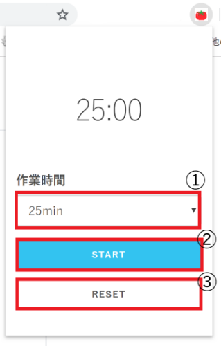
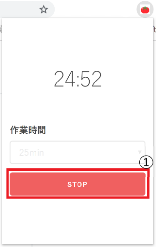

# [tomato](https://chrome.google.com/webstore/detail/tomato/odpmjdncgfgjoikmfpmpmhdlpdbhokbb)
ポモドーロテクニックで扱われている時間のみに限定したタイマーアプリです。

## 概要
#### タイマー動作前(または一時停止中)の画面

1. 時間指定
1. STARTボタン
1. RESETボタン

- ①で時間の選択ができます。洗濯できる時間は20, 25, 30分です。
- ②でタイマーを開始します。
- ③で残り時間をリセットします。
- **※START後は残り時間が無くなるかRESETをクリックすると残り時間の変更ができます。**
- 時間になると通知が届きます。
- アプリを閉じていてもカウントダウンされます。

#### タイマー動作中の画面

1. STOPボタン

- ①のボタンをクリックすると一時停止できます。

## 技術的な要素
- HTML, CSS, JavaScript
- jQuery3.4.1
- [Skeleton.css](http://getskeleton.com/)
- Chrome.notifications API
- Chrome.storage API

## その他
### なぜChrome.alarms APIを使用しなかったか
一時停止の機能を実装するにあたり、再開する際に秒数の指定も必要だった。しかしChrome.alarmsだと分単位でしか設定できないためJavaScriptのsetInterval()を使用した。

### なぜイベントページにしなかったのか。なぜバックグラウンドなのか。
これも一時停止の機能を実現するため。イベントページではsetInterval()が動作しない。

### 実装に関して
1. 「タイマー開始→ポップアップを閉じる→再度開く」という時にbackground.jsで計算している残り時間を表示するところが難しかった。
    - 「ポップアップを表示してからbackgroundの残り時間を取得して表示する」という処理を挟むので、**時間の同期を取るのが難しかった**。
    - 対応方法としては、backgroundの残り時間を取得したあと一旦backgroundのカウントダウンを止め、ポップアップ側のJSから再度カウントダウンを開始することでbackgroundとの同期を実現した。
2. 関係性を分離してオブジェクトにすることでコードの読みやすさを意識した。
    - そのまんま
    - ただ残り時間オブジェクトの値をそのまま変更する(状態が変化し続ける)のでデバッグの時ちょっと厳しいかも。